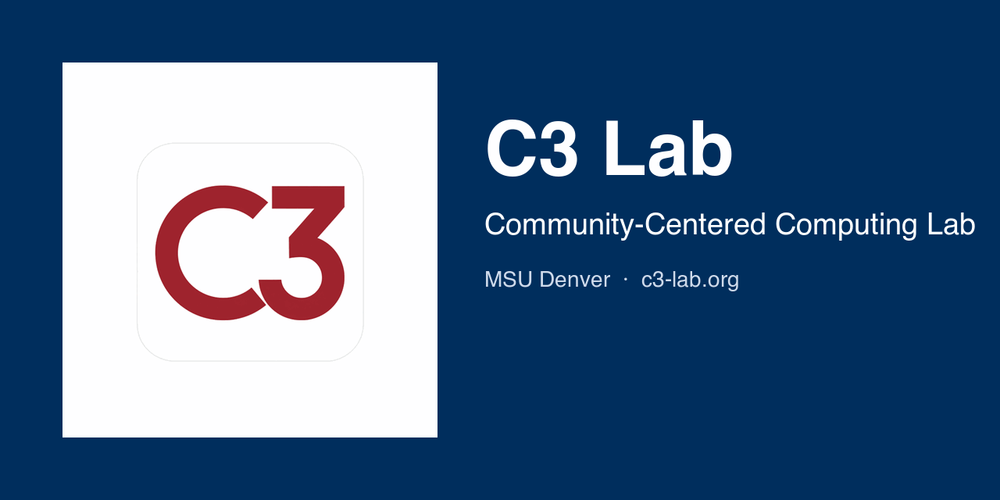

# C3 Lab - Community-Centered Computing Lab



[](https://github.com/msu-denver/c3-lab/actions/workflows/ci.yml)

The official website for the C3 Lab (Community-Centered Computing Lab) at Metropolitan State University of Denver.

## About the C3 Lab

The C3 Lab is a research lab in the Department of Computer Sciences at MSU Denver, co-directed by Dr. Daniel Pittman and Dr. Ranjidha Rajan, with Alyssa Williams as its Technical Project Manager (TPM). We design and build technologies that support communities through accessible data systems, applied AI, and user-centered computing.

### Current Projects

- **Colorado Sustainability Hub** - A statewide sustainability-data platform integrating AI, geospatial systems, and natural language interaction. Features Bili, an AI-powered sustainability assistant. (NSF Award #2318730 + NAIRR Pilot)
- **RILE Connect** - A statewide STEM mentorship and opportunity-matching platform connecting K-12 schools, higher education, nonprofits, and industry partners (SIPA GovGrants)
- **Roadrunner Connect** - MSU Denver's all-in-one mobile and web platform for campus event discovery and engagement, built by students for the community
- **Peer Support Hub** - A unified platform for coordinating SI, TA, and LA peer support programs at MSU Denver (MSU Denver)

## Website

Visit the live site at: [c3-lab.org](https://c3-lab.org/)

### Site Features

- Responsive design optimized for mobile and desktop
- WCAG AA accessible (skip links, focus states, color contrast)
- SEO optimized with sitemap.xml and meta tags
- MSU Denver branded with official colors

## Development

This site is built with [Jekyll](https://jekyllrb.com/) and hosted on GitHub Pages.

### Local Development

```bash
# Install dependencies
bundle install

# Run local server
./serve.sh
```

The site will be available at `http://localhost:4000/`

### Prerequisites

- Ruby 2.7+
- Bundler (`gem install bundler`)

### Project Structure

```
c3-lab/
├── _config.yml         # Jekyll configuration
├── _layouts/           # Page templates
├── _includes/          # Reusable components (header, footer)
├── _projects/          # Project collection pages
├── _posts/             # News/updates
├── assets/
│   ├── css/style.css   # Main stylesheet
│   └── images/         # Images and icons
├── index.html          # Homepage
├── about.md            # About page
├── team.md             # Team page
└── projects/           # Projects index
```

## Contributing

This repository is maintained by the C3 Lab team. See [`CONTRIBUTING.md`](CONTRIBUTING.md) for the contributor guide and [`SECURITY.md`](SECURITY.md) for the vulnerability disclosure policy.

## License

Copyright (c) 2026 C3 Lab, Metropolitan State University of Denver. All rights reserved.

## Contact

**Lab Directors:**
- **Dr. Daniel Pittman** - dpittma8@msudenver.edu
- **Dr. Ranjidha Rajan** - rranjidh@msudenver.edu

**Technical Project Manager:**
- **Alyssa Williams** - awill157@msudenver.edu

**Department of Computer Sciences:** [msudenver.edu/computer-sciences](https://www.msudenver.edu/computer-sciences/)

**Interested in joining?** [Express Interest Form](https://forms.office.com/r/6wgNT9HscW)
